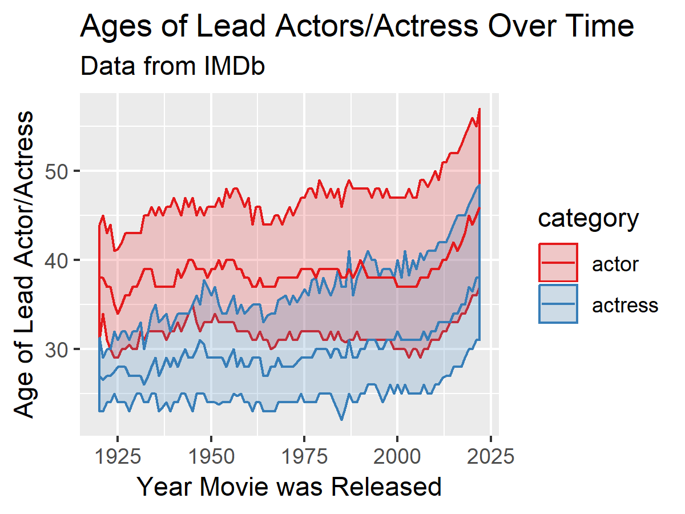
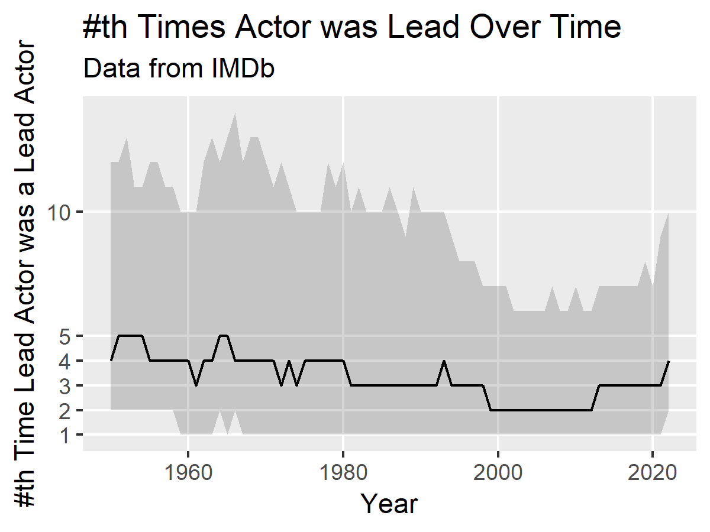

# Import Libraries
```{r}
library(tidyverse)
library(ggrepel)
library(gghighlight)
library(ggridges)
library(tidytext)
library(scales)

sessionInfo()
```

# Read IMDb Data Helper Function
```{r}
read_imdb <- function(data_path) {
  path <- "data/"
  read_tsv(paste0(path, data_path), na = "\\N", quote = '', progress=T)
}
```

# Title Ratings

## Import Data
```{r}
df_ratings <- read_imdb("title.ratings.tsv")
df_ratings %>% head()
```

## Create Plot
```{r}
plot <- ggplot(df_ratings, aes(x = numVotes, y = averageRating)) +
          geom_bin2d() +
          scale_x_log10(labels = comma) +
          scale_y_continuous(breaks = 0:10) +
          scale_fill_viridis_c(option = "inferno") +
          labs(title="Number of Votes vs Average Rating",
               subtitle="Data from IMDb",
               x="Number of Votes",
               y="Average User Rating")

ggsave("output/plots/title-ratings-num-votes-avg-rating.png", plot, width=4, height=3)
```


 
# Title Basics

## Import Data
```{r}
df_basics <- read_imdb('title.basics.tsv')
df_ratings <- df_ratings %>% left_join(df_basics)
df_ratings %>% head()
```

## Create Plot - Movie Runtime vs Average Movie Rating
```{r}
plot <- ggplot(df_ratings %>% filter(runtimeMinutes < 180, runtimeMinutes > 20), aes(x = runtimeMinutes, y = averageRating)) +
          geom_bin2d() +
          scale_x_continuous(breaks = seq(0, 180, 60), labels = 0:3) +
          scale_y_continuous(breaks = 0:10) +
          scale_fill_viridis_c(option = "inferno") +
          theme_minimal(base_family = "Source Sans Pro") +
          labs(title="Movie Runtime vs Average Movie Rating",
               subtitle="Data from IMDb",
               x="Runtime (Hours)",
               y="Average User Rating")

ggsave("output/plots/title-basics-runtime-avg-user-rating.png", plot, width=4, height=3)
```


## Create Plot - Movie Release Year vs Average Rating
```{r}
plot <- ggplot(df_ratings %>% filter(titleType == "movie", numVotes >= 10), aes(x = startYear, y = averageRating)) +
          geom_bin2d() +
          geom_smooth(color="black") +
          scale_x_continuous() +
          scale_y_continuous(breaks = 1:10) +
          scale_fill_viridis_c(option = "plasma", labels = comma, trans = 'log10') +
          labs(title="Movie Release Year vs Average Rating",
               subtitle="Data from IMDb",
               x="Year Movie was Released",
               y="Average User Rating")

ggsave("output/plots/title-basics-movie-release-year-avg-rating.png", plot, width=4, height=3)
```


# Name Basics

## Import Data
```{r}
df_actors <- read_imdb('name.basics.tsv') %>%
              filter(str_detect(primaryProfession, "actor|actress"))  %>%
              select(nconst, primaryName, birthYear)
df_actors %>% head()
```

# Principals Basic

## Import Data
```{r}
df_principals <- read_imdb('title.principals.tsv') %>%
              filter(str_detect(category, "actor|actress")) %>%
              select(tconst, ordering, nconst, category) %>%
              group_by(tconst) %>%
              filter(ordering == min(ordering))
  
df_principals %>% head()
```

# Age Lead

## Join Data
```{r}
df_principals <- df_principals %>% left_join(df_actors)
df_ratings <- df_ratings %>% left_join(df_principals)
df_ratings_movies <- df_ratings %>%
                        filter(titleType == "movie", !is.na(birthYear), numVotes >= 10) %>%
                        mutate(age_lead = startYear - birthYear)
                        
df_ratings_movies %>% head()
```
```{r}
df_actor_ages_lead <- df_ratings_movies %>%
                  group_by(startYear, category) %>%
                  summarize(low_age = quantile(age_lead, 0.25, na.rm = T),
                            med_age = quantile(age_lead, 0.50, na.rm = T),
                            high_age = quantile(age_lead, 0.75, na.rm = T))

df_actor_ages_lead %>% head()
```

## Plot - Ages of Lead Actors/Actress Over Time
```{r}
plot <- ggplot(df_actor_ages_lead %>% filter(startYear >= 1920), aes(x=startYear, fill=category, color=category)) +
          geom_ribbon(aes(ymin = low_age, ymax = high_age), alpha = 0.2) +
          geom_line(aes(y = med_age)) +
          scale_fill_brewer(palette = "Set1") +
          scale_color_brewer(palette = "Set1") +
          labs(title="Ages of Lead Actors/Actress Over Time",
               subtitle="Data from IMDb",
               x="Year Movie was Released",
               y="Age of Lead Actor/Actress")

ggsave("output/plots/change-in-ages-movie-leads.png", plot, width=4, height=3)
```



# Lead Actor nth Time
```{r}
df_ratings_movies_nth <- df_ratings_movies %>%
                      group_by(nconst) %>%
                      arrange(startYear) %>%
                      mutate(nth_lead = row_number()) %>%
                      ungroup() %>%
                      arrange(desc(startYear), desc(numVotes))

df_ratings_movies_nth %>% select(primaryTitle, primaryName, nth_lead) %>% head()
```

```{r}
df_actor_ages <- df_ratings_movies_nth %>%
                  group_by(startYear) %>%
                  summarize(low_nth = quantile(nth_lead, 0.25),
                            med_nth = quantile(nth_lead, 0.50),
                            high_nth = quantile(nth_lead, 0.75)) %>%
                  arrange(startYear)
df_actor_ages %>% head()
```

# Plot - Nth Time Lead Actor was Lead Actor Over Time
```{r}
plot <- ggplot(df_actor_ages %>% filter(startYear >= 1950) , aes(x = startYear)) +
          geom_ribbon(aes(ymin=low_nth, ymax=high_nth), alpha=0.2) +
          geom_line(aes(y=med_nth)) +
          scale_y_continuous(breaks=c(1:5, 10)) +
          labs(title="#th Times Actor was Lead Over Time",
               subtitle="Data from IMDb",
               x="Year",
               y="#th Time Lead Actor was a Lead Actor") +
          theme(panel.grid.minor = element_blank())
ggsave("output/plots/th-time-lead-actor-was-a-lead-actor-over-time.png", plot, width=4, height=3)
```

