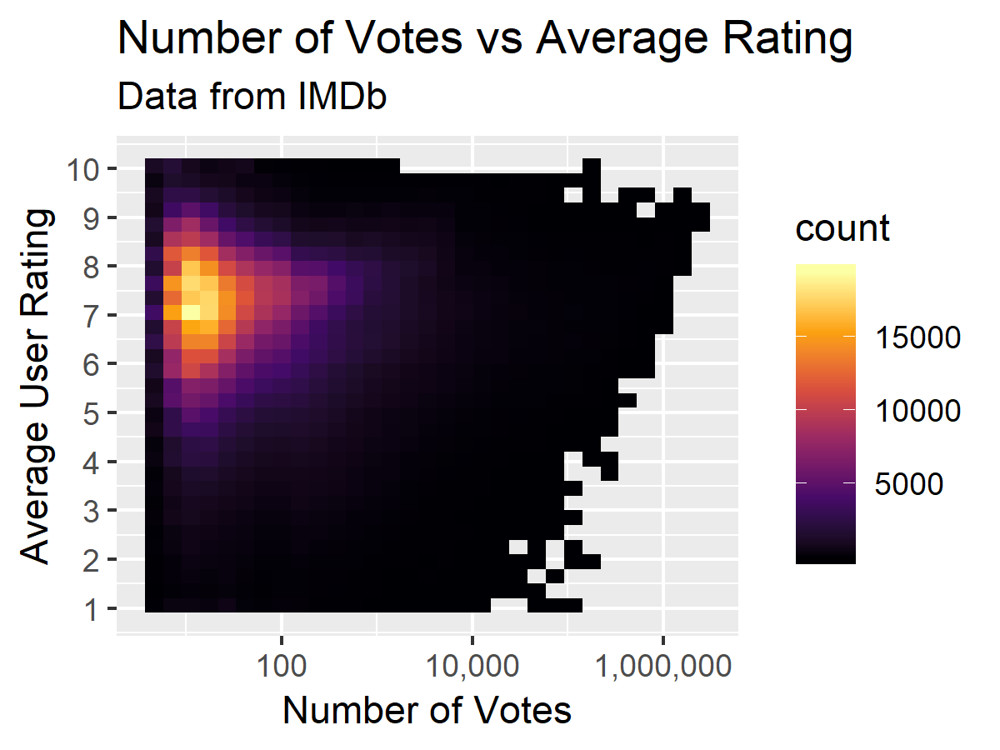
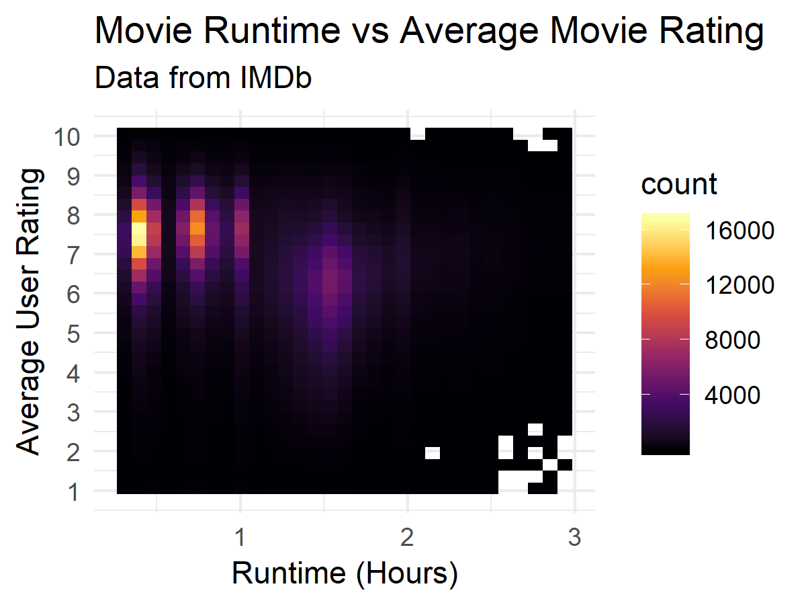
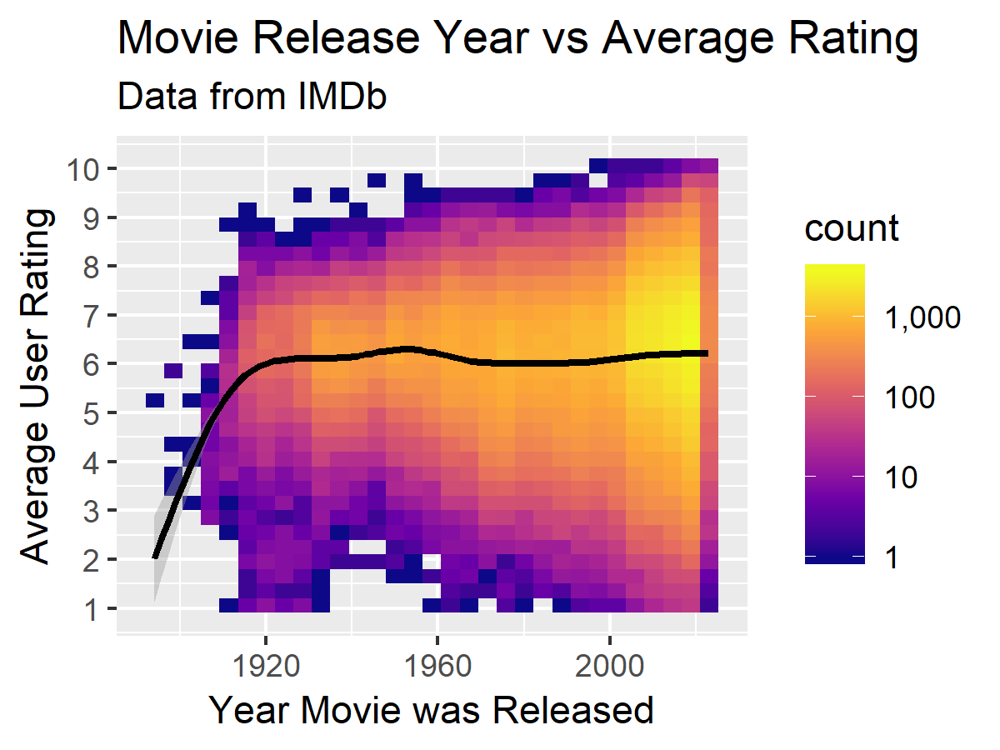

# Import Libraries
```{r}
library(tidyverse)
library(ggrepel)
library(gghighlight)
library(ggridges)
library(tidytext)
library(scales)

sessionInfo()
```

# Read IMDb Data Helper Function
```{r}
read_imdb <- function(data_path) {
  path <- "data/"
  read_tsv(paste0(path, data_path), na = "\\N", quote = '', progress=T)
}
```

# Title Ratings

## Import Data
```{r}
df_ratings <- read_imdb("title.ratings.tsv")
df_ratings %>% head()
```

## Create Plot
```{r}
plot <- ggplot(df_ratings, aes(x = numVotes, y = averageRating)) +
          geom_bin2d() +
          scale_x_log10(labels = comma) +
          scale_y_continuous(breaks = 0:10) +
          scale_fill_viridis_c(option = "inferno") +
          labs(title="Number of Votes vs Average Rating",
               subtitle="Data from IMDb",
               x="Number of Votes",
               y="Average User Rating")

ggsave("output/plots/title-ratings-num-votes-avg-rating.png", plot, width=4, height=3)
```


 
# Title Basics

## Import Data
```{r}
df_basics <- read_imdb('title.basics.tsv')
df_basics <- df_ratings %>% left_join(df_basics)
df_basics %>% head()
```

## Create Plot - Movie Runtime vs Average Movie Rating
```{r}
plot <- ggplot(df_basics %>% filter(runtimeMinutes < 180, runtimeMinutes > 20), aes(x = runtimeMinutes, y = averageRating)) +
          geom_bin2d() +
          scale_x_continuous(breaks = seq(0, 180, 60), labels = 0:3) +
          scale_y_continuous(breaks = 0:10) +
          scale_fill_viridis_c(option = "inferno") +
          theme_minimal(base_family = "Source Sans Pro") +
          labs(title="Movie Runtime vs Average Movie Rating",
               subtitle="Data from IMDb",
               x="Runtime (Hours)",
               y="Average User Rating")

ggsave("output/plots/title-basics-runtime-avg-user-rating.png", plot, width=4, height=3)
```



## Create Plot - Movie Release Year vs Average Rating
```{r}
plot <- ggplot(df_basics %>% filter(titleType == "movie", numVotes >= 10), aes(x = startYear, y = averageRating)) +
          geom_bin2d() +
          geom_smooth(color="black") +
          scale_x_continuous() +
          scale_y_continuous(breaks = 1:10) +
          scale_fill_viridis_c(option = "plasma", labels = comma, trans = 'log10') +
          labs(title="Movie Release Year vs Average Rating",
               subtitle="Data from IMDb",
               x="Year Movie was Released",
               y="Average User Rating")

ggsave("output/plots/title-basics-movie-release-year-avg-rating.png", plot, width=4, height=3)
```



# Name Basics

## Import Data
```{r}
df_actors <- read_imdb('name.basics.tsv') %>%
              filter(str_detect(primaryProfession, "actor|actress"))  %>%
              select(nconst, primaryName, birthYear)
df_actors %>% head()
```
